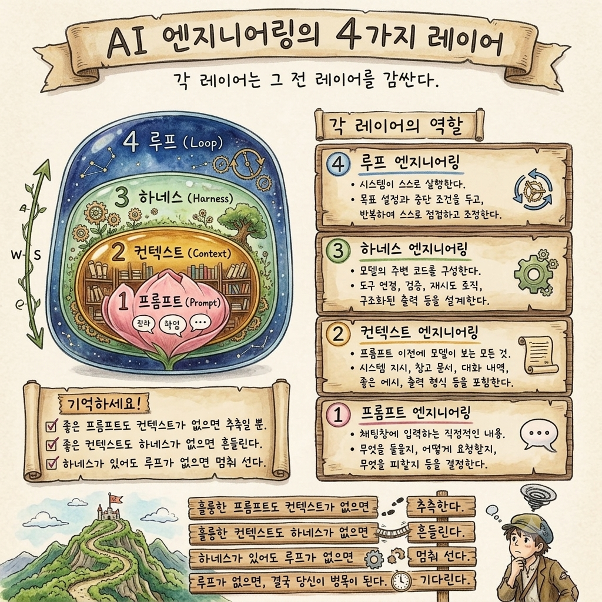

# AI 엔지니어링: 3대 AI로 배우는 4가지 레이어

AI 시스템을 구축할 때 반드시 고려해야 하는 **4가지 핵심 레이어(프롬프트 · 컨텍스트 · 하네스 · 루프)**를,
대표적인 **3대 생성형 AI**를 기준으로 각각 정리한 저장소입니다.

세 문서는 동일한 "책 추천 봇" 예제를 사용해, 같은 개념이 각 AI의 API에서 어떻게 구현되는지 비교할 수 있도록 구성했습니다.



---

## 📚 3대 AI 문서

| AI | 제공사 | 핵심 특징 | 문서 |
| :--- | :--- | :--- | :--- |
| **Claude (클로드)** | Anthropic | 긴 컨텍스트 처리와 안전성, 에이전트/도구 연동(MCP)에 강점 | [documents/claude.md](documents/claude.md) |
| **Gemini (제미나이)** | Google | 멀티모달 네이티브, 초장문 컨텍스트, 구글 생태계 연동 | [documents/gemini.md](documents/gemini.md) |
| **ChatGPT (챗지피티)** | OpenAI | 범용성과 풍부한 생태계, 강력한 Function Calling / 구조화 출력 | [documents/chatgpt.md](documents/chatgpt.md) |

---

## 🧩 4가지 레이어 한눈에 보기

각 레이어는 이전 레이어를 감싸며 AI 시스템의 안정성, 정확성, 자동화 수준을 높여줍니다.

| 레이어 | 의미 | 비유 | 주요 역할 |
| :--- | :--- | :--- | :--- |
| **1. 프롬프트 (Prompt)** | 사용자가 입력하는 직접적인 명령어 | **씨앗** (핵심 알맹이) | AI에게 무엇을 묻고 요청할지 결정 |
| **2. 컨텍스트 (Context)** | System Prompt, 배경 지식, 제약 조건 | **토양** (자라나는 배경) | AI가 참고할 맥락과 출력 형식 지정 |
| **3. 하네스 (Harness)** | 코드로 감싼 입력/출력 검증 및 예외 처리 | **화분** (모양을 잡아줌) | 에러 방지, 구조화된 데이터(JSON) 강제 |
| **4. 루프 (Loop)** | 에이전트 구조의 자가 검증 및 반복 수정 | **자동 급수 장치** (스스로 순환) | 목표 달성까지 [생성 ➔ 평가 ➔ 수정] 반복 |

> 각 레이어의 상세 설명과 실제 구현 코드는 위 3대 AI 문서에서 확인할 수 있습니다.

---

## 🤖 AI별 요약

### 1. Claude (클로드) — Anthropic
긴 컨텍스트를 안정적으로 처리하고 지침을 일관되게 따르는 데 강점이 있습니다.
Tool Use와 MCP(Model Context Protocol) 기반의 에이전트 구성에 최적화되어 하네스/루프 레이어와 잘 맞습니다.
👉 자세히 보기: [documents/claude.md](documents/claude.md)

### 2. Gemini (제미나이) — Google
텍스트·이미지·오디오·비디오를 하나의 모델에서 다루는 멀티모달 네이티브 모델입니다.
초장문 컨텍스트 윈도우와 `response_schema` 기반 구조화 출력, 구글 클라우드(Vertex AI) 연동이 강력합니다.
👉 자세히 보기: [documents/gemini.md](documents/gemini.md)

### 3. ChatGPT (챗지피티) — OpenAI
방대한 사용자층과 GPTs · Assistants API 등 풍부한 생태계를 보유합니다.
`response_format`과 JSON Schema 기반 구조화 출력, 성숙한 Function Calling으로 하네스·에이전트 구성에 유리합니다.
👉 자세히 보기: [documents/chatgpt.md](documents/chatgpt.md)

---

## 💡 결론
- **프롬프트와 컨텍스트**만으로는 AI가 주의사항을 누락하거나 환각(Hallucination)을 일으킨 답변이 그대로 노출될 수 있습니다.
- **하네스와 루프** 레이어를 결합해 파이프라인을 구축하면, 어떤 AI를 쓰든 유저에게 전달되기 전에 시스템 내부에서 스스로 검증하고 정제된 결과물만 보장할 수 있습니다.

---

## 🗂️ 저장소 구조

```
ai-engineering/
├── README.md              # 본 문서 (3대 AI 개요 + 4가지 레이어 요약)
├── documents/
│   ├── claude.md          # Claude(클로드) 기준 4가지 레이어 상세
│   ├── gemini.md          # Gemini(제미나이) 기준 4가지 레이어 상세
│   └── chatgpt.md         # ChatGPT(챗지피티) 기준 4가지 레이어 상세
├── img/
│   ├── ai-engineering-4-layers.png            # 4가지 레이어 개념도
│   ├── claude-code-proejct-structure.png      # Claude Code 프로젝트 구조
│   ├── gemini-cli-project-structure.png       # Gemini CLI 프로젝트 구조
│   └── chatgpt-codex-project-structure.png    # Codex CLI(ChatGPT) 프로젝트 구조
└── scripts/
    └── system_prompt.md   # 데이터셋 법적 리스크 검토 시스템 프롬프트
                           # (문장 끝에 클릭 가능한 출처 링크 [N] 자동 명시)
```
